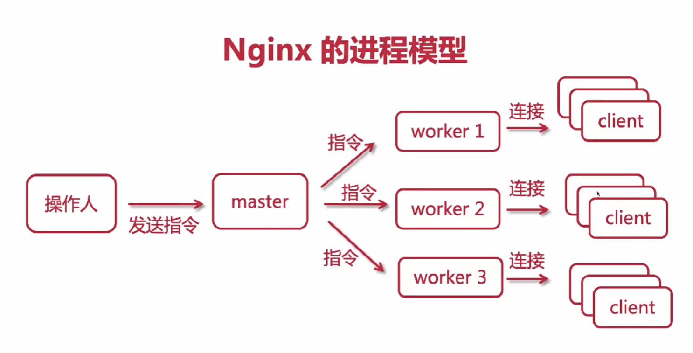
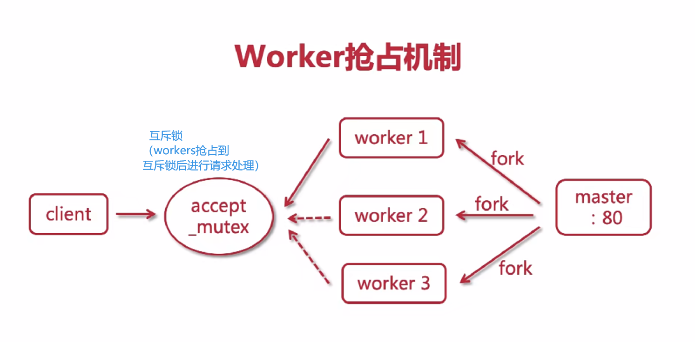
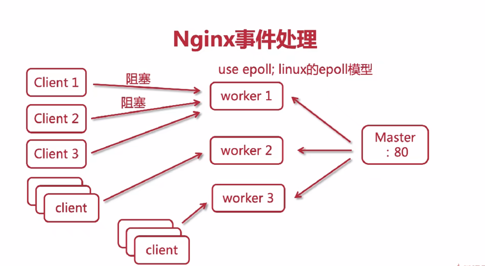
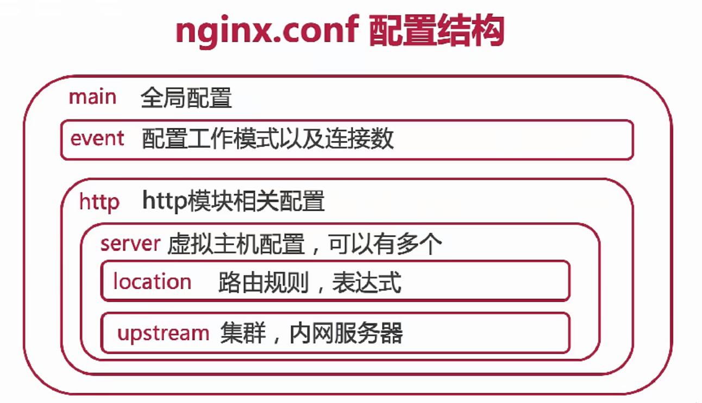

> 正向代理：client->proxy(正向代理，vpn)->target server
> 
> 反向代理：client->target server->proxy(反向代理，nginx)->real server1/real server2

### nginx 安装
[安装教程](https://docs.nginx.com/nginx/admin-guide/installing-nginx/installing-nginx-open-source/)

[配置教程](https://learn.microsoft.com/zh-cn/troubleshoot/developer/webapps/aspnetcore/practice-troubleshoot-linux/2-2-install-nginx-configure-it-reverse-proxy)
```bash
# 安装
sudo apt-get install nginx
# 启用
sudo systemctl start nginx
# 检查 Nginx 的状态
systemctl status nginx
# 重启 Nginx
sudo systemctl restart nginx
```
nginx config
```config
server {
    listen 80; # 监听端口
    server_name localhist; # 监听的域名
    
    location / { # 路径映射  "/" 根路径映射到html文件夹
        root html; 
        index index.html index.htm;  
    }
    
    error_page 500 502 503 504 /50x.html; # 服务器内部错误页面映射
    localtion = /50x.html {
        root html;
    }
}
```

### nginx工作进程
master 进程：主进程，nginx收到信号后将工作分发给工作进程
worker 进程：工作进程，默认只有一个
```
# nginx.config
worker_processes 1;
```


### worker抢占机制


### nginx事件处理
```nginx config
event {
    user epoll; # 异步非阻塞
    worker_connections: 1024; # 默认worker进程的连接数
}
```


> nginx可以处理高并发的原因：worker抢占机制；异步非阻塞的通信模式（多路复用器）。

### nginx配置文件机构
